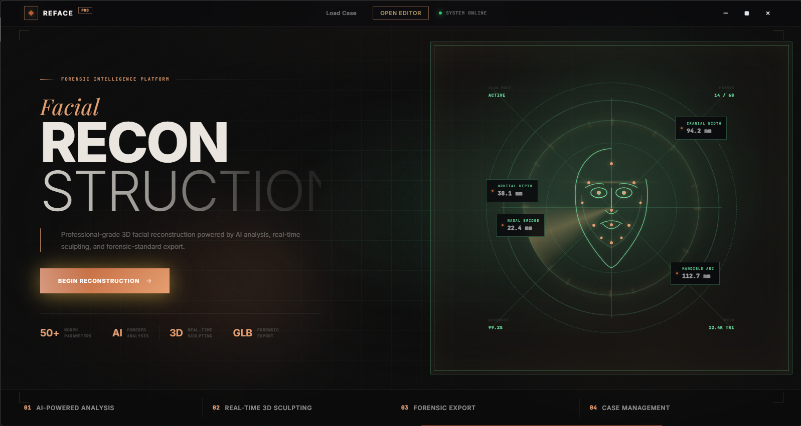
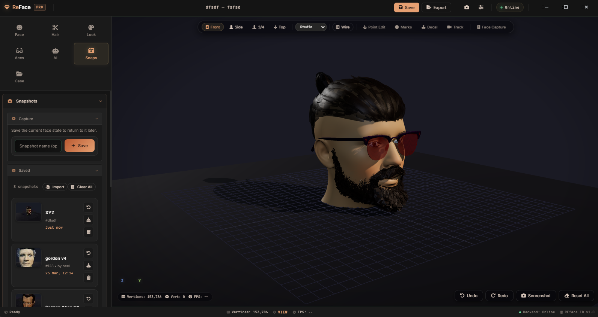
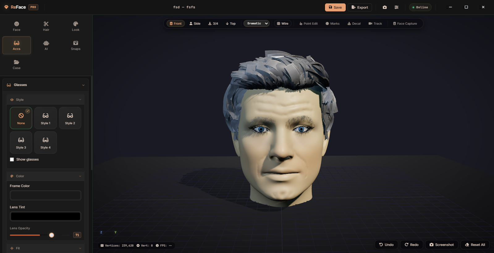
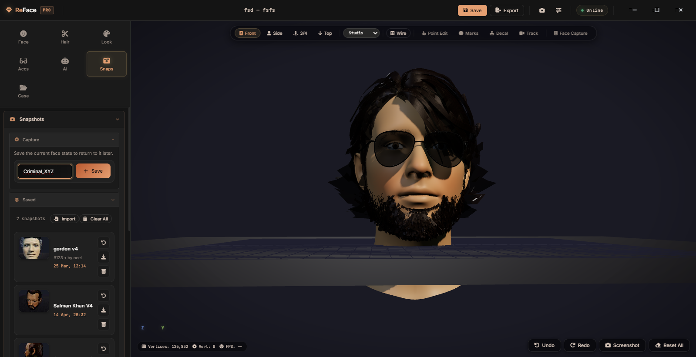

<div align="center">

<a href="https://youtu.be/Kt6TKoFV9VM">
  
</a>

# ReFace

### Intelligent 3D Facial Reconstruction for Forensics

**Describe a face in plain words, or sculpt it by hand. Watch it take shape in 3D.**

A desktop workbench for forensic facial reconstruction. Drive a human head with
natural language, fine-tune it across 60+ anatomical controls in a full manual
editor, and render it in Blender.

<br/>

[](https://youtu.be/Kt6TKoFV9VM)

[](https://www.electronjs.org/)
[](https://threejs.org/)
[](https://www.python.org/)
[](https://flask.palletsprojects.com/)
[](https://www.blender.org/)
[](#license)

</div>

---

## What it is

ReFace turns a witness statement into a 3D face. An investigator types or speaks a
description. An AI model maps that language onto precise morph values. The
parametric head reshapes live. Blender renders the final portrait and exports a
mesh for downstream use.

But ReFace is more than a prompt box. Under the hood sits a **complete manual
editor** — every skull, feature, hair, skin, and accessory control is yours to
tune by hand. The AI gives you a strong first draft in seconds. The editor lets
you refine it until it matches the witness exactly.

Built as a single Electron app: a Three.js viewport up front, a Flask + Blender
engine behind it.

> 💡 **Tip** — **[▶ Watch the 2-minute demo](https://youtu.be/Kt6TKoFV9VM)** to see
> the full flow, from description to rendered face.

---

## Two ways to build. Best results from both.

<table>
<tr>
<td width="33%" valign="top">

### 🤖 AI-first

Describe the face in plain language or feed reference photos. Claude or Gemini
resolves it into 60+ validated parameters and builds the head in seconds.

</td>
<td width="33%" valign="top">

### 🎚️ Manual editor

A full control surface. Sculpt the skull, features, hair, skin, marks, and
accessories by hand with live feedback in the 3D viewport.

</td>
<td width="33%" valign="top">

### 🔀 The combination

Let AI lay the foundation, then refine every detail by hand. In practice, the
hybrid workflow produces the most accurate reconstructions.

</td>
</tr>
</table>

---

## The workspace

<div align="center">



<sub>The editor — live Three.js viewport, tool rail, and snapshot history</sub>

</div>

<br/>

<div align="center">
<table>
<tr>
<td width="50%"></td>
<td width="50%"></td>
</tr>
<tr>
<td align="center"><sub>Skin, wrinkles, and iris color dialed in</sub></td>
<td align="center"><sub>Accessories on, snapshots saved per case</sub></td>
</tr>
</table>
</div>

---

## Features

| | Capability | Detail |
|---|---|---|
| 🗣️ | **Natural-language sculpting** | Type or speak a description. Claude or Gemini translates it to parameters. |
| 🎚️ | **60+ morph controls** | Skull, forehead, brows, eyes, nose, cheeks, mouth, jaw, chin, ears. |
| 🖼️ | **Reference images** | Feed photos alongside the text prompt to guide the build. |
| 💇 | **Hair & facial hair** | 12 hairstyles plus bald, beards and moustache, with length, density, curl, tint. |
| 👁️ | **Eyes, brows, glasses** | Iris color, brow shape, multiple glasses frames with tint and opacity. |
| 🩹 | **Skin & marks** | Tone, pigmentation, wrinkles, lip color, plus scars, moles, birthmarks, wounds. |
| 📸 | **Snapshots** | Save any face state per case and jump back to it later. |
| 🎨 | **Blender rendering** | High-fidelity portraits rendered headless through the Blender engine. |
| 📦 | **Export** | OBJ, FBX, and GLB out. Case files save and reload as `.rfc`. |

---

## How it works

```text
  Investigator            Frontend                        Backend
  text / voice            Electron + Three.js             Flask · server.py
 ┌──────────────┐         ┌────────────────────┐          ┌──────────────────┐
 │ "narrow jaw, │ ──────▶ │  Renderer          │  ─POST─▶ │  API router      │
 │  thin nose"  │         │  live 3D viewport  │          │                  │
 │  (describe)  │         │  + manual editor   │          └─────────┬────────┘
 └──────────────┘         └────────────────────┘                    │
                                                          ┌─────────┴────────┐
                                                          ▼                  ▼
                                                  ┌───────────────┐  ┌───────────────┐
                                                  │ AI providers  │  │ Blender engine│
                                                  │ Claude·Gemini │  │ render·export │
                                                  └───────────────┘  └───────────────┘

  results  (morph params · render · export)  flow back into the live viewport  ◀──
```

1. The renderer captures a description and posts it to the backend.
2. Claude or Gemini returns a validated set of morph, hair, and skin values.
3. Three.js applies them to the parametric head in real time.
4. Blender bakes the final render and export on demand.

---

## Getting started

### Prerequisites

- **Node.js** 18 or newer
- **Python** 3.10 or newer
- **Blender** installed and on your PATH (rendering + export engine)
- A **Conda env** named `reface` is auto-detected if present, else system `python` is used

### Install

```bash
# frontend + electron
npm install

# backend
pip install -r backend/requirements.txt
```

### Configure

Copy the example env and add your keys.

```bash
cp .env.example .env
```

```ini
ANTHROPIC_API_KEY=sk-ant-...
GEMINI_API_KEY=...
AI_PROVIDER=anthropic   # or: gemini
```

> 📝 **Note** — Only the provider you set in `AI_PROVIDER` needs a key. The app
> runs without AI too. Every control is editable by hand in the manual editor.

### Run

```bash
npm run dev          # backend + electron together
```

Or start each side on its own:

```bash
npm run start:backend    # Flask server only
npm start                # Electron shell only
```

---

## Project structure

```
reface/
├── src/
│   ├── main/                 Electron main process + preload bridge
│   └── renderer/
│       ├── index.html        App shell (hero → case → editor screens)
│       ├── js/               30 modules: morphing, hair, eyes, skin, AI, cases
│       ├── js/vendor/        Three.js loaders + OrbitControls
│       └── styles/           Palette, panels, editor layout
├── backend/
│   ├── server.py             Flask API — AI, morph, render, export, cases
│   ├── analyze_mesh.py       Mesh inspection utilities
│   └── blender_scripts/      Headless Blender jobs (render, morph, export, hair)
├── assets/
│   ├── models/               Base head, hair, facial-feature meshes
│   ├── Glasses/              Glasses frame models
│   └── Hair_Previews/        Hairstyle preview clips
└── screenshots/              README imagery
```

---

## Tech stack

| Layer | Tools |
|---|---|
| Shell | Electron 28, frameless custom titlebar |
| 3D viewport | Three.js r160, OrbitControls, GLB / OBJ loaders |
| Backend | Python, Flask, Flask-CORS |
| AI | Anthropic Claude, Google Gemini |
| Voice | SpeechRecognition |
| Rendering | Blender (headless) |
| Packaging | electron-builder |

---

## Ethical use

ReFace is a tool for **authorized forensic and investigative work**. Faces it
produces are approximations built from descriptions, not identifications. Treat
every output as an investigative aid, subject to human review, not as proof.

---

## License

Released under the **ISC License**. See the `license` field in
[package.json](package.json).

<div align="center">
<sub>Built by the ReFace team · powered by Blender</sub>
</div>
